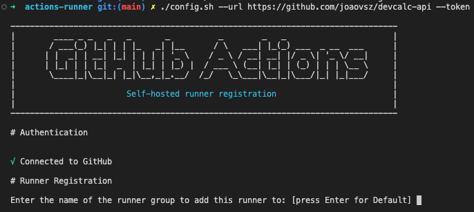
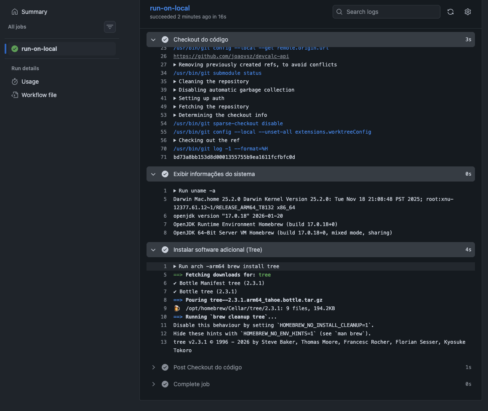
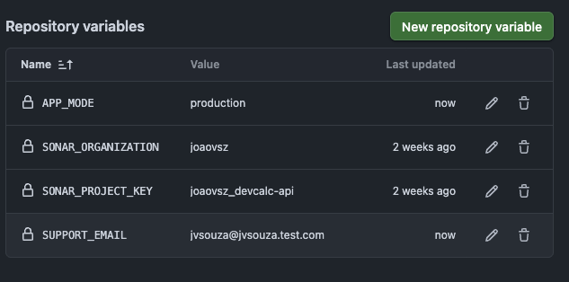
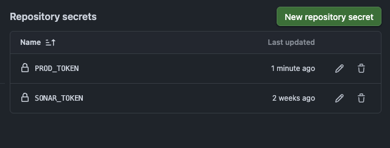
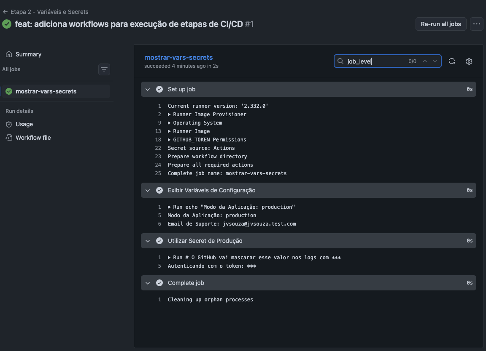
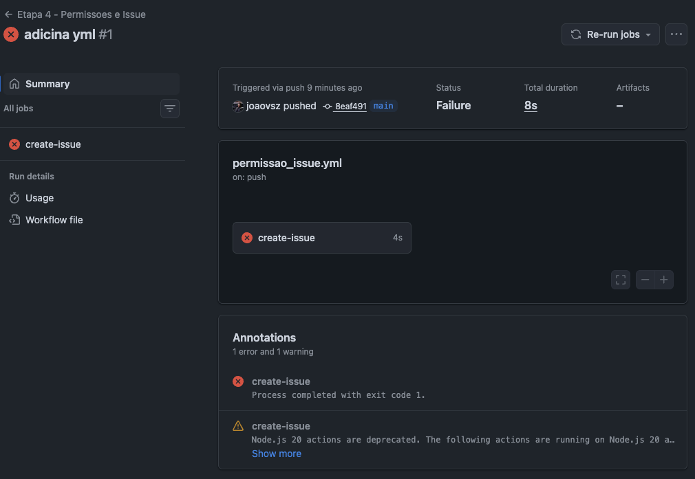
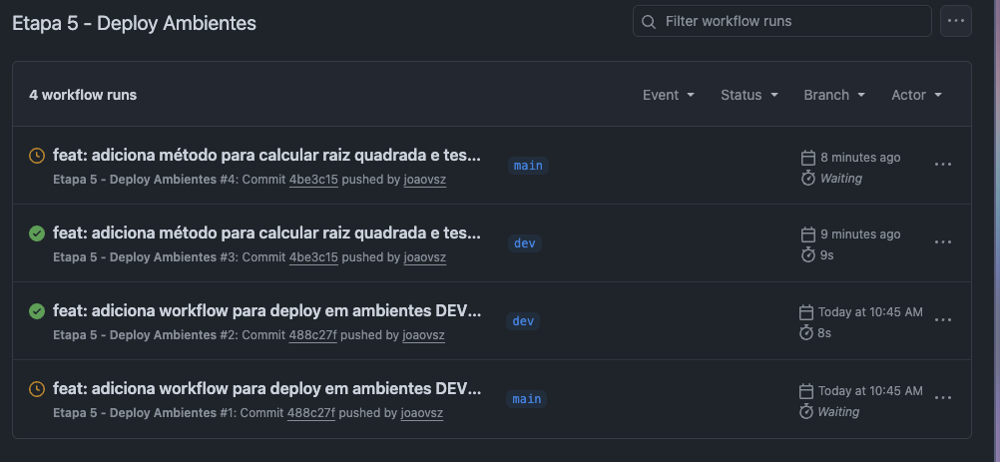
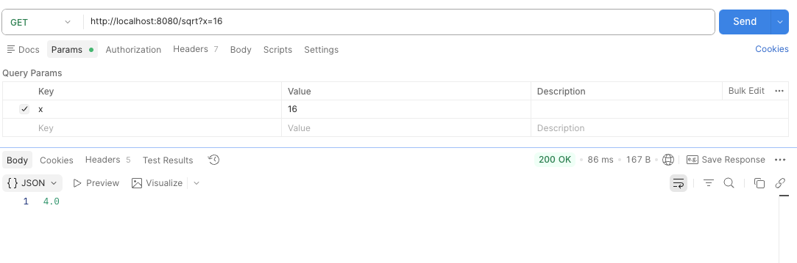

# TP3 - Evolucao do Pipeline CI/CD

## 1. Configuracao de Runner Auto-Hospedado

Configurei um runner na minha propria maquina (usando a arquitetura ARM64 do Mac) para rodar os workflows do GitHub Actions localmente. Com isso, instalei o pacote `tree` pelo Homebrew direto no runner para provar que a minha maquina esta recebendo e executando os comandos enviados pelo pipeline.

## 2. Uso de Variaveis e Secrets no Workflow

Tirei a exposicao de dados fixos e sensiveis que poderiam ficar abertos no codigo do pipeline. Criei variaveis de ambiente comuns (`APP_MODE` e `SUPPORT_EMAIL`) e um segredo (`PROD_TOKEN`) direto no painel do GitHub. Isso garante que as credenciais fiquem protegidas e mascaradas automaticamente na hora da execucao.

## 3. Contextos e Escopos de Variaveis de Ambiente

Organizei as variaveis em diferentes escopos (workflow, job e step) para mostrar como elas se sobrepoem de forma hierarquica. Tambem puxei informacoes do contexto nativo do GitHub, mostrando quem acionou a acao (`github.actor`) e qual o sistema do runner (`runner.os`), deixando o rastreio da execucao muito mais inteligente.

## 4. Controle de Permissoes e Uso do GITHUB_TOKEN

Ajustei as permissoes do token padrao do repositorio para dar acesso de escrita nas issues (`issues: write`). Quebrei o fluxo simulando um erro no deploy e deixei o proprio bot do GitHub Actions responsavel por abrir um ticket de falha automaticamente se algo der errado.

## 5. Ambientes de Deploy para Dev e Prod

Separei a infraestrutura logica criando os ambientes de `dev` e `prod`. Coloquei uma regra de protecao no ambiente de producao para que o codigo nao seja publicado direto. Agora, o fluxo pausa e exige que eu faca uma revisao manual (`Required reviewers`) antes de liberar a versao final.

Observacao: apesar do arquivo se chamar `workflows-etapa6.png`, o conteudo do print mostra a etapa 5 ("Deploy Ambientes").

## 6. Implementacao e Integracao de Nova Funcionalidade na API

Fiz uma atualizacao na aplicacao Java e adicionei o endpoint `GET /sqrt?x={valor}` para calcular a raiz quadrada. Centralizei a regra de negocio no service e fiz testes unitarios, tratando inclusive o erro de numeros negativos. Depois enviei para o repositorio, garantindo que o pipeline fizesse o build e todos os testes passassem.

